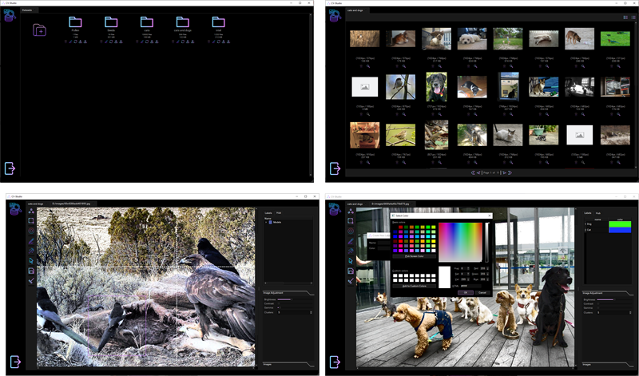

# CV-Studio

</img>
 
CV-Studio is a graphical annotation tool to address different Computer Vision tasks. 

CV-Studio is developed in Python, Qt, SQLite and uses PyTorch's resources to train deep learning models.

 

CVStudio supports:

**Datasets**:
* Create and manage your datasets for images.
* Manually annotate images:
    * Using a label system for classification problems.
    * Using a bounding box for localization and object detection problems.
    * Using a polygon tool or freehand selection for segmentation tasks.
* Auto-annotate images with a pretrained model to continue tagging the images by your own.

[Watch a demo video](https://www.youtube.com/watch?v=xtNhWr083lM)

## Roadmap

* **Datasets:** Annotations for videos.
* **Platforms:**  macOS support.

## Installation

> **Note:** CV-Studio only have been developed and tested on Windows, and linux. Future platforms are in the roadmap.

### 1. Install cvstudio

``pip install cvstudio``

### 2. Install pytorch

- Using GPU:<br>
```console
    pip install --pre torch torchvision -f https://download.pytorch.org/whl/nightly/cu101/torch_nightly.html             
```
- Using CPU:<br>
```console
   pip install --pre torch torchvision -f https://download.pytorch.org/whl/nightly/cpu/torch_nightly.html        
```

### 3. Download pre-trained models

This command must be executed from the CVStudio folder:
**Windows (PowerShell)**
 ```console
    Invoke-WebRequest -OutFile ./models/MS_DeepLab_resnet_trained_VOC.pth https://data.vision.ee.ethz.ch/csergi/share/DEXTR/MS_DeepLab_resnet_trained_VOC.pth
    Invoke-WebRequest -OutFile ./models/dextr_pascal-sbd.pth https://data.vision.ee.ethz.ch/csergi/share/DEXTR/dextr_pascal-sbd.pth
```

**Linux**
```console
    wget https://data.vision.ee.ethz.ch/csergi/share/DEXTR/MS_DeepLab_resnet_trained_VOC.pth -P ./models
    wget https://data.vision.ee.ethz.ch/csergi/share/DEXTR/dextr_pascal-sbd.pth -P ./models
```

### 4. Run CVStudio
```console
    cvstudio
```

## Documentation

Check out the [wiki](https://github.com/haruiz/CvStudio/wiki).

## How to contribute

Send a pull request.
 
## License

[Free software: MIT license](https://github.com/haruiz/CvStudio.git/blob/master/LICENSE)

Citation: haruiz. CV-Studio. Git code (2019). https://github.com/haruiz/CvStudio

## Credits

### Images and Icons
* <div>Icons made by <a href="https://www.flaticon.com/authors/dave-gandy" title="Dave Gandy">Dave Gandy</a> from <a href="https://www.flaticon.com/" title="Flaticon">www.flaticon.com</a></div>
* <div>Icons made by <a href="https://www.flaticon.com/authors/pixelmeetup" title="Pixelmeetup">Pixelmeetup</a> from <a href="https://www.flaticon.com/" title="Flaticon">www.flaticon.com</a></div>
* <div>Icons made by <a href="https://www.flaticon.com/authors/smashicons" title="Smashicons">Smashicons</a> from <a href="https://www.flaticon.com/" title="Flaticon">www.flaticon.com</a></div>
* <div>Icons made by <a href="https://www.flaticon.com/authors/eucalyp" title="Eucalyp">Eucalyp</a> from <a href="https://www.flaticon.com/" title="Flaticon">www.flaticon.com</a></div>
* <div>Icons made by <a href="https://www.flaticon.com/authors/becris" title="Becris">Becris</a> from <a href="https://www.flaticon.com/" title="Flaticon">www.flaticon.com</a></div>
* <div>Icons made by <a href="https://www.flaticon.com/authors/smashicons" title="Smashicons">Smashicons</a> from <a href="https://www.flaticon.com/" title="Flaticon">www.flaticon.com</a></div>
* <div>Icons made by <a href="https://www.flaticon.com/authors/freepik" title="Freepik">Freepik</a> from <a href="https://www.flaticon.com/" title="Flaticon">www.flaticon.com</a></div>
* <div>Icons made by <a href="https://www.flaticon.com/authors/those-icons" title="Those Icons">Those Icons</a> from <a href="https://www.flaticon.com/" title="Flaticon">www.flaticon.com</a></div>

### Models 

[Deep Extreme Cut: From Extreme Points to Object Segmentation](https://github.com/scaelles/DEXTR-PyTorch/)
</img> 